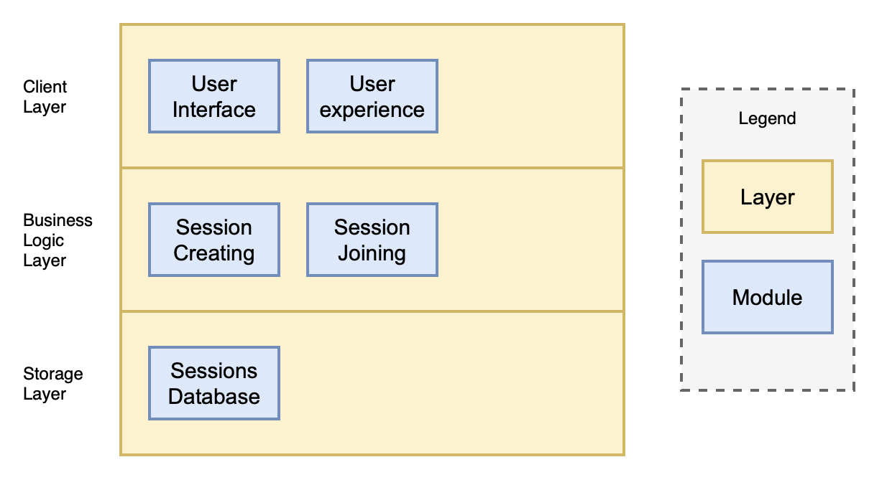
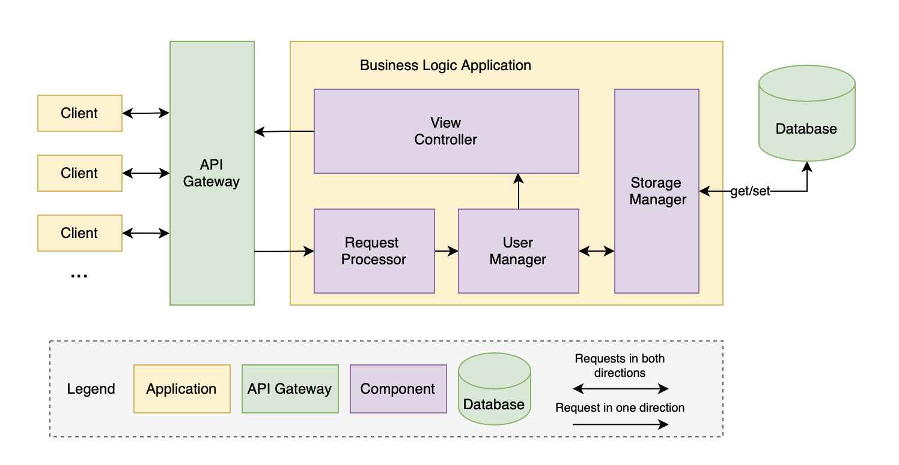
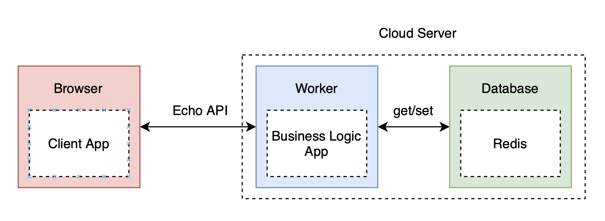
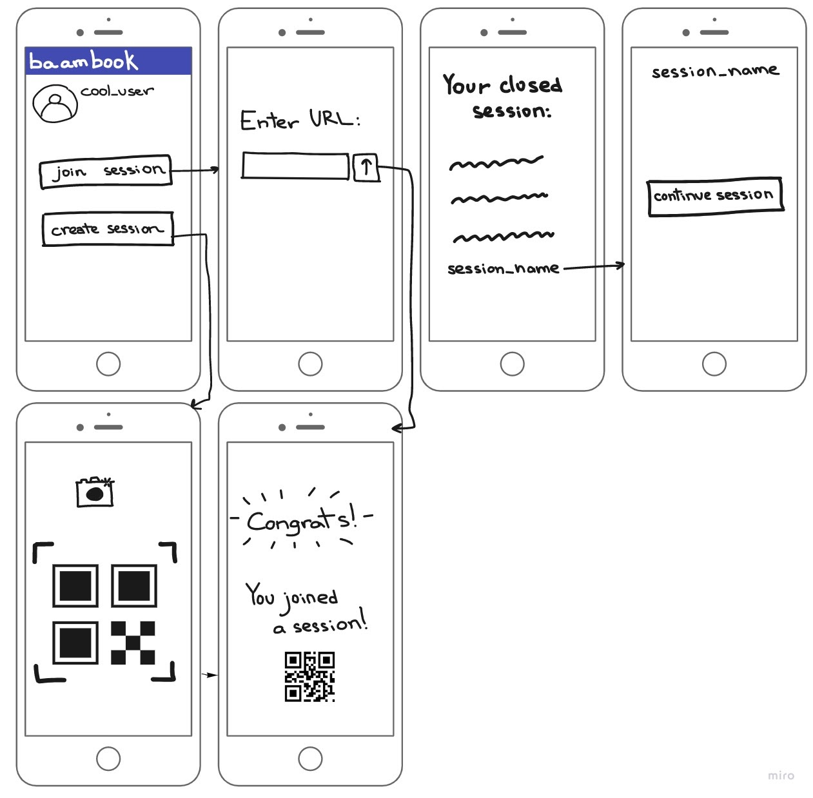

## Table of Contents

- [Table of Contents](#table-of-contents)
- [Business Goals and Objectives](#business-goals-and-objectives)
- [Roles and Responsibilities](#roles-and-responsibilities)
- [Requirement Analysis and Specifications](#requirement-analysis-and-specifications)
  - [Features](#features)
  - [User Stories](#user-stories)
  - [Non-Functional Requirements](#non-functional-requirements)
- [Software Architecture](#software-architecture)
  - [Architectural Drivers](#architectural-drivers)
  - [Static View](#static-view)
  - [Dynamic View](#dynamic-view)
  - [Allocation View](#allocation-view)
- [Project Glossary](#project-glossary)
- [Low Fidelity Prototype](#low-fidelity-prototype)
- [Software Development Plan](#software-development-plan)
  - [Inception Phase](#inception-phase)
  - [Elaboration Phase](#elaboration-phase)
  - [Construction Phase](#construction-phase)
  - [Transition Phase](#transition-phase)

## Business Goals and Objectives

Description:

- The baambook is an application to share QR codes to other people using live sharing sessions. You can start a session and scan any QR code to share it with people who joined you using URL.

Goals and Objectives:

- Allow users to share QR codes anywhere from the world and anytime with an Internet connection
- Allow users to scan code even if it changes quickly.
- Allow users to copy a code with description of animal or plant for a biology report with the help of a friend who works the zoo or visit it.
- Allow users to transfer information inside a single QR code or sequence of them.
- Allow users not to use the application to bypass the [baam](https://baam.duckdns.org) system.

## Roles and Responsibilities

| Name              | Roles                     |
| :---------------- | ------------------------- |
| Kseniya Kudasheva | Project Manager, Designer |
| Igor Belov        | Technical writer, QA      |
| Alexander Krotov  | Full-stack Developer      |
| Mark Nicholson    | Technical writer          |

| **Stakeholder’s Name** | **Roles**        | **Responsibilities**                                         |
| ---------------------- | ---------------- | ------------------------------------------------------------ |
| Kseniya Kudasheva      | Management, Tech | Verify compliance with project organization and workflow requirements |
| Igor Belov             | Tech             | Check compliance with technical requirements                 |

## Requirement Analysis and Specifications

### Features

| ID # | User Story Title                       | Priority  | Any Other Label |
| ---- | -------------------------------------- | --------- | --------------- |
| 1.1  | Creating QR code sharing session       | Must      | User            |
| 1.2  | Joining the session                    | Must      | User            |
| 1.3  | See the last code in completed session | Desirable | User            |
| 2.1  | Session sharing                        | Must      | Host            |
| 2.2  | QR code live sharing                   | Must      | Host            |
| 2.3  | Resume session                         | Desirable | Host            |
| 3.1  | Small latency                          | Must      | User            |
| 3.2  | High-quality code scanner              | Desirable | Host            |

### User Stories

| User Type        | User Story Title                       | User stories                                                 |
| ---------------- | -------------------------------------- | ------------------------------------------------------------ |
| **Regular User** | Creating QR code sharing session       | As a user I want to create a QR code sharing session and become its host. |
|                  | Joining the session                    | As a user I want to join an existing QR code sharing session using URL. |
|                  | Small latency                          | As a user I want to see QR codes with the minimal delay      |
|                  | See the last code in completed session | As a user I want to see the last QR code of a completed session when joining it in a while. |
| **Session Host** | Session sharing                        | As a host of the sharing session I want to share a URL to my session so other people can join. |
|                  | Live QR code sharing                   | As a host I want to share QR code to users connected to my session. |
|                  | High-quality code scanner              | As a host I want to scan QR code in bad lighting conditions. |
|                  | Resume Session                         | As a host I want to be able to continue the session after some time when I open a shared URL. |

### Non-Functional Requirements

| Title               | Description                                                  | How we can meet                                     |
| ------------------- | ------------------------------------------------------------ | --------------------------------------------------- |
| **Simplicity**      | Intuitive in use.                                            | Work out UI and UX.                                 |
| **Usability**       | Hassle-free access to all declared features.                 | Work out UX.                                        |
| **Security**        | The user must be sure that his data is protected by encryption. | Work out client-server architecture.                |
| **Stability**       | To keep the server running and responding to client requests. | Work out client-server Echo API.                    |
| **Maintainability** | Easy and fast to fix in case of faults                       | Simple and understandable structure of application. |

## Software Architecture

### Architectural Drivers

| Driver                      | Key                                    | Value                            |
| --------------------------- | -------------------------------------- | -------------------------------- |
| **Technical Constraints**   | Programming language                   | Elixir, TypeScript               |
|                             | Support of a specific platform         | Web                              |
|                             | Use of a specific library or framework | Phoenix Framework, Svelte.js     |
| **Business Constraints**    | Timing                                 | Limited by the end of the course |
|                             | Budget                                 | Absent                           |
| **Functional Requirements** | Described in the sections 3.1 and 3.2  |                                  |
| **Quality Attributes**      | Described in the section 3.3           |                                  |

### Static View

### Dynamic View

### Allocation View

## Project Glossary

| Term              | Description                                                  |
| ----------------- | ------------------------------------------------------------ |
| QR code           | Type of barcode that can be read easily by a digital device and which stores information as a series of pixels in a square-shaped grid. |
| Echo API          | Simple call that allows you to validate how you are calling the Genability APIs |
| Redis             | In-memory data structure store.                              |
| Elixir            | Functional, concurrent, general-purpose programming language. |
| UI                | Anything a user may interact with to use a digital product or service. |
| UX                | The internal experience that a person has as they interact with every aspect of a company’s products and services. |
| Phoenix Framework | Web-development framework written in the functional programming language Elixir. |
| Svelte.js         | Open-source front end compiler.                              |
| TypeScript        | Programming language developed and maintained by Microsoft.  |

## Low Fidelity Prototype

## Software Development Plan

### Inception Phase

| # Iteration | Timeline               | Stakeholders      | Activities                                                   | Artifacts                                                    |
| ----------- | ---------------------- | ----------------- | ------------------------------------------------------------ | ------------------------------------------------------------ |
| #1          | 23/08/2021- 27/08/2021 | Kseniya Kudasheva | Determine Business goals and objectives with valid justification | Deliver the documentation of achieved milestones. User stories |
| #2          | 30/08/2021- 03/09/2021 | Kseniya Kudasheva | Establish roles and responsibilities                         | Update the documentation of achieved milestones with requirements. Design prototype. |

### Elaboration Phase

| Iteration | Timeline               | Stakeholders      | Activities                                                   | Artifacts                                                    |
| --------- | ---------------------- | ----------------- | ------------------------------------------------------------ | ------------------------------------------------------------ |
| #1        | 06/09/2021- 09/09/2021 | Kseniya Kudasheva | Revise User Stories (100%) Conduct design prototype with stakeholder and start designing Create database schema | Document 100% user stories Database schema Design (20%) |
| #2        | 13/08/2021- 17/08/2021 | Kseniya Kudasheva | Software development planning & start work Design (70%) Writing documentation on design Software Architecture | Iteration Plan Documentation on design Design (70%) Software architecture |
| #3        | 20/08/2021- 24/08/2021 | Kseniya Kudasheva | Test Plan                                                    | Software architecture document Test Plan Document       |

### Construction Phase

| Iteration | Timeline               | Stakeholders | Activities                            | Artifacts                                                    |
| --------- | ---------------------- | ------------ | ------------------------------------- | ------------------------------------------------------------ |
| #1        | 30/08/2021- 03/09/2021 | Igor Belov   | Implement Features 1.1, 1.2, 2.1, 2.2 | Working Features 1.1, 1.2, 2.1, 2.2. Live presentation of working features. |
| #2        | 06/09/2021- 10/09/2021 | Igor Belov   | Implement Features 3.1 and 3.2        | Working Features 3.1 and 3.2. Live presentation of working features. |
| #3        | 06/09/2021- 10/09/2021 | Igor Belov   | Implement Features 1.3 and 2.3        | Working Features 1.3 and 2.3. Live presentation of working features. |

### Transition Phase

| Iteration | Timeline              | Stakeholders      | Activities                      | Artifacts                                                    |
| --------- | --------------------- | ----------------- | ------------------------------- | ------------------------------------------------------------ |
| #1        | 13/09/2021-17/09/2021 | Kseniya Kudasheva | Integration, End to end testing | Github repository Merged branches Integration and test results Final README for developers and Users |
| #2        |                       |                   | Final product release           | Working Product                                              |

